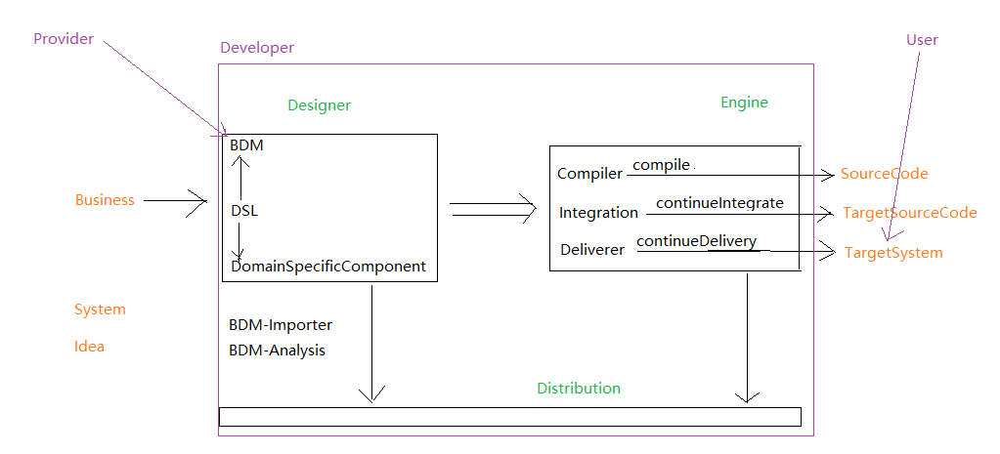

# 更多文档请前往[docs](docs)目录查看

# laas-web

## 设计器

### 数据处理层

#### 元数据

##### 元数据管理

##### 元数据层级可视化及快速定位

#### 数据录入表单

多个层的表单需要联动

##### 前端层-数据录入表单

##### web层-数据录入表单

#### 数据操作DSL

其实就是业务层, 而且其实开发大部分花费的时间都是在这个上面

##### 操作元数据领域数据

##### 操作常规数据

##### 调用领域专属组件

##### 兼容历史项目

为了兼容历史项目

###### 历史项目分析组件

###### 历史项目编译器

###### 历史项目接入组件

###### 历史项目部署兼容组件

### 领域专属组件层

使用模板技术从标准版项目中抽取模板代码

#### 标准前端层

跟vue的component设计思路类似

#### 标准后台层

服务(springboot-web)

中间件

​	数据库

​	缓存

​	消息队列

第三方服务

#### 标准编译层

模型转译、DSL转译、 专属组件转译接入适配、部署状态适配、部署文件生成
A分析->B优化->C测试->D集成->E监控->A

#### 标准运行态层

以Dockerfile和Docker容器编排或者ansible playbook文件为典型例子, 需要注意的是持续部署, 然后这一块通常是配合工单使用

## 分发库

存储、拉取 已设计代码

## 执行引擎

加载并运行 运行层

# 期望值

业务人员只需要关注企业业务数据流转, 极大提高效率

甚至于, 如果专门去培养 产品开发 来使用这个项目开发项目, 好处之多简直不敢想象

技术和业务的发展形成一个正向循环
